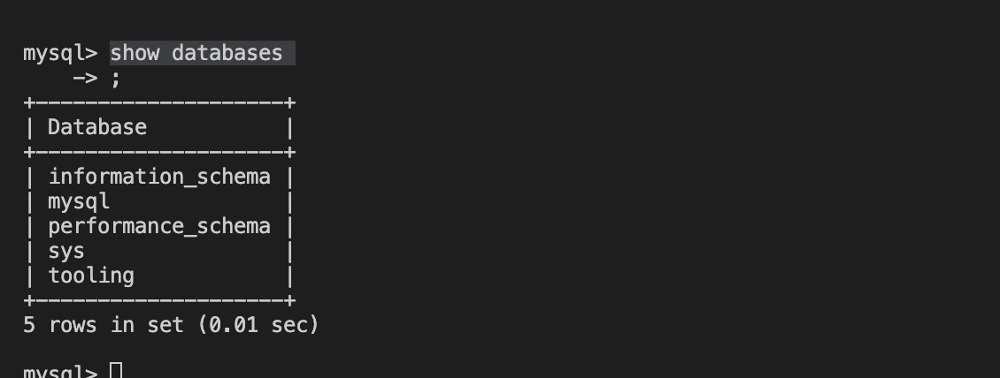

## documentation for the Database server

`sudo apt update`
`sudo apt install mysql-server -y`
`sudo mysql`
`create database tooling;`
`create user 'webaccess'@'172.31.80.0/20' identified by 'password';`
`grant all privileges on tooling.* to 'webaccess'@'172.31.80.0/20';`
`flush privileges;`
`show databases`

`sudo vi /etc/mysql/mysql.conf.d/mysqld.cnf`
`sudo systemctl restart mysql`