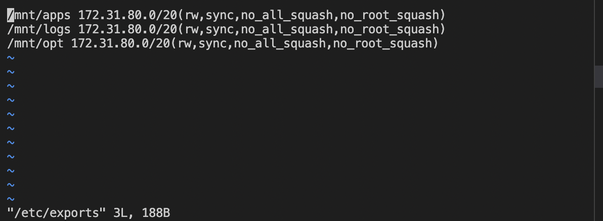

## documentation for the nfs

`lsblk`
`sudo gdisk /dev/xvdf`
`sudo gdisk /dev/xvdg`
`sudo gdisk /dev/xvdh`
`sudo yum install lvm2 -y`
`sudo pvcreate /dev/xvdf1`
`sudo pvcreate /dev/xvdg1`
`sudo pvcreate /dev/xvdh1`
`sudo vgcreate webdata-vg /dev/xvdh1 /dev/xvdg1 /dev/xvdf1`
`sudo lvcreate -n lv-apps -L 9G webdata-vg`
`sudo lvcreate -n lv-logs -L 9G webdata-vg`
`sudo lvcreate -n lv-opt -L 9G webdata-vg`
`lsblk`

`sudo mkfs -t xfs /dev/webdata-vg/lv-apps`
`sudo mkfs -t xfs /dev/webdata-vg/lv-logs`
`sudo mkfs -t xfs /dev/webdata-vg/lv-opt`
`sudo mkdir /mnt/apps`
`sudo mkdir /mnt/logs`
`sudo mkdir /mnt/opt`
`sudo mount /dev/webdata-vg/lv-apps /mnt/apps`
`sudo mount /dev/webdata-vg/lv-logs /mnt/logs`
`sudo mount /dev/webdata-vg/lv-opt /mnt/opt`
`sudo yum -y update`
`sudo yum install nfs-utils -y`
`sudo systemctl start nfs-server.service`
`sudo systemctl enable nfs-server.service`
`sudo systemctl status nfs-server.service`

`sudo chown -R nobody: /mnt/apps`
`sudo chown -R nobody: /mnt/logs`
`sudo chown -R nobody: /mnt/opt`
`sudo chmod -R 777 /mnt/apps`
`sudo chmod -R 777 /mnt/logs`
`sudo chmod -R 777 /mnt/opt`
`sudo systemctl restart nfs-server.service`
`sudo vi /etc/exports`

`sudo exportfs -arv`
`rpcinfo -p | grep nfs`

